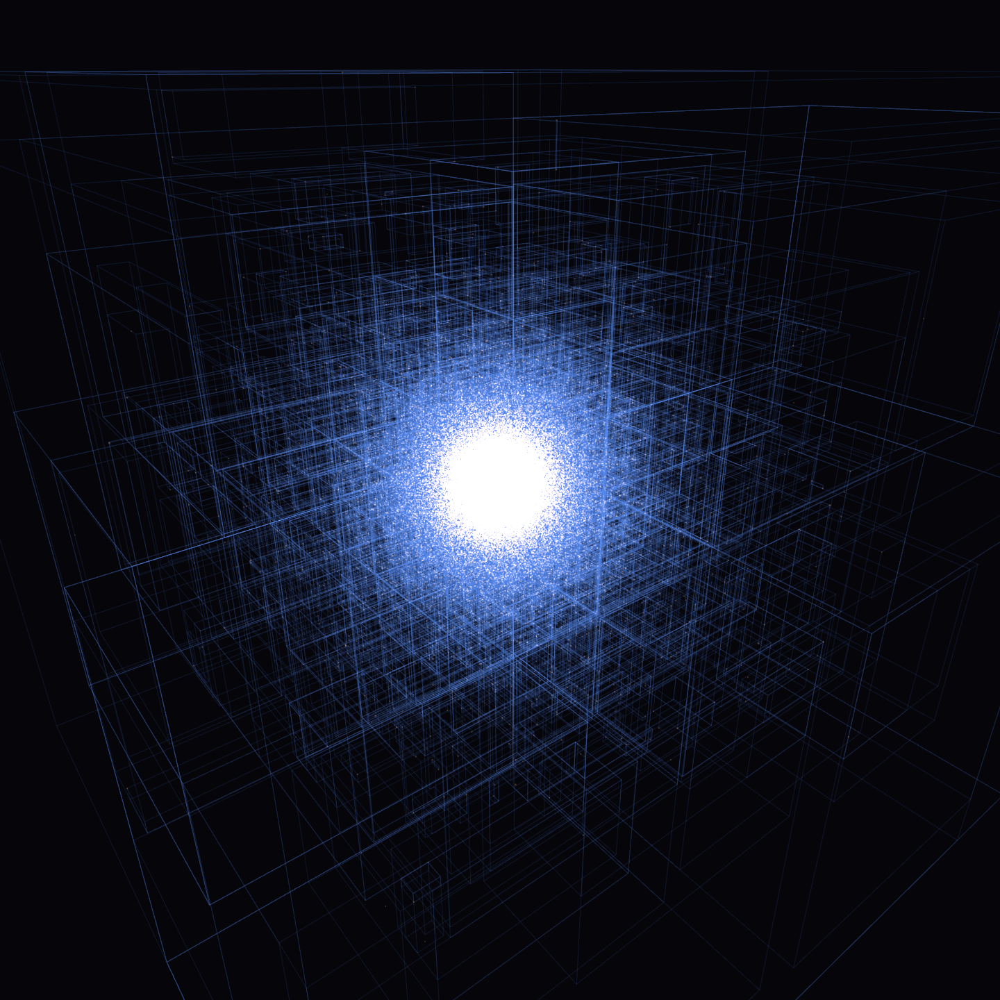
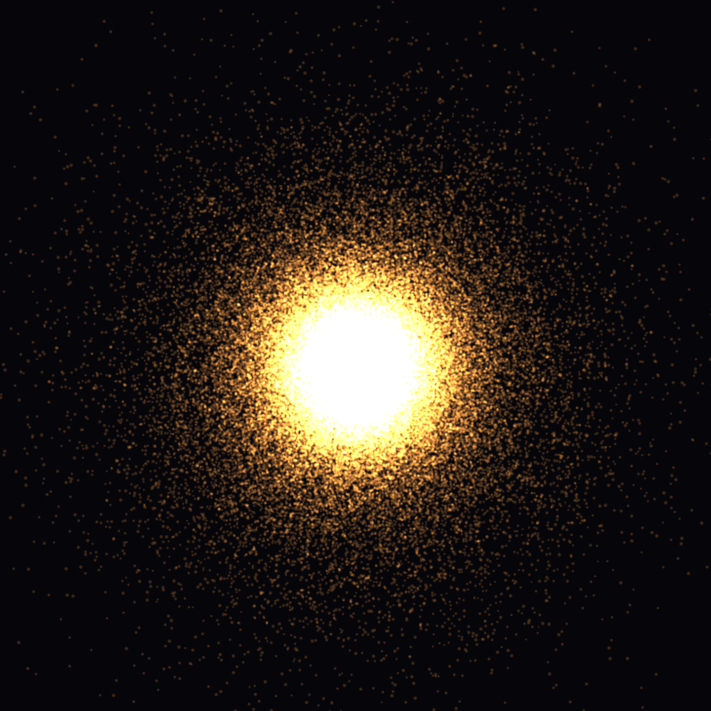
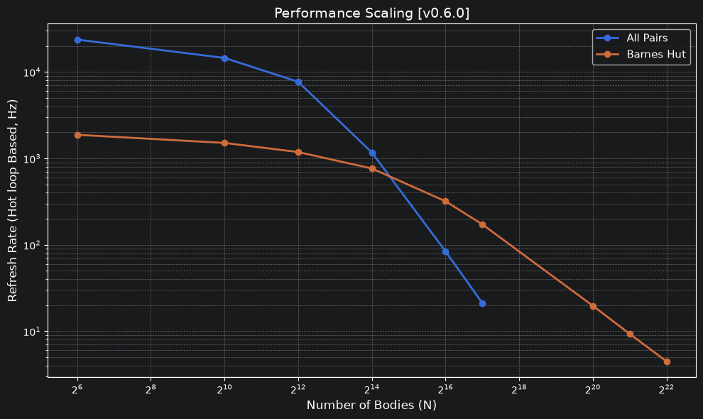
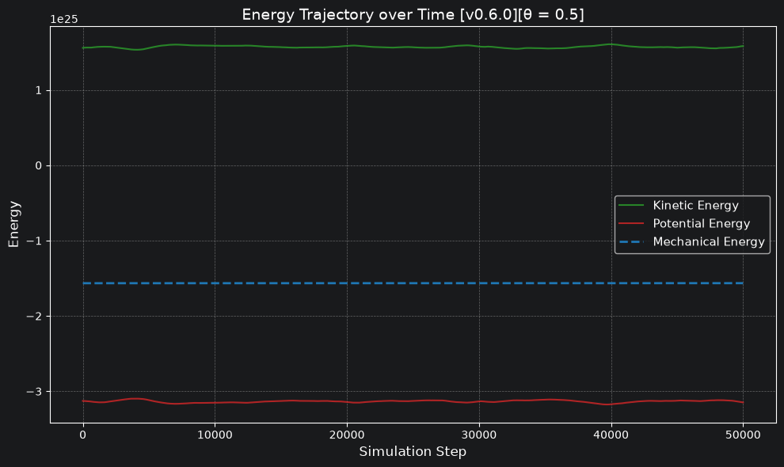
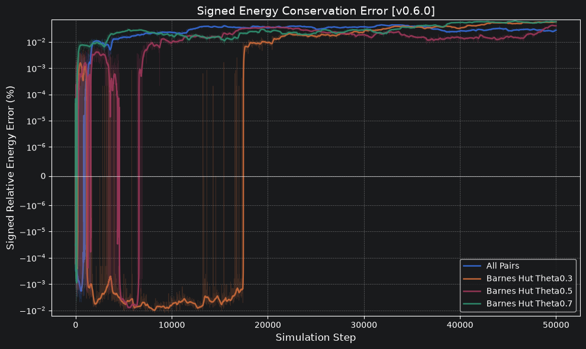

## ykaylani/nbody

A GPU N-Body simulation written in C++ and CUDA.

<p>
  
  
</p>

## Features
Calculations are offloaded to the GPU using CUDA.
* **Modular Architecture:** Built using the Strategy pattern, allowing you to swap out components:
    * **Solvers:** **Barnes-Hut (Radix Tree) / All-Pairs** solvers
    * **Distributions:** **Plummer / Kuzmin / Random** distributions
    * **Exporters:** **CSV / XDMF / VTP** exporters
* **Configuration:** Tweak simulation constants (such as body count, time delta (`dt`), softening factors, and debugging flags) using a config.ini file.
* **Visualization:** Visualize the simulation using OpenGL.

## Prerequisites
To compile and run this project, you will need:
* Compiler supporting **C++ 20**
* CMake ≥ 4.2
* CUDA Toolkit
* OpenGL
* GLEW

## Build Guidelines

1. Open a terminal
2. Navigate to the root directory of the project
3. Create a build directory: 
```bash 
mkdir build
cd build
```
4. Generate the build from CMake, then compile the executable:
```bash
cmake ..
cmake --build . --config Release
```
Once the build process is complete, the executable should be located inside a subfolder.
To run the simulation:
```bash
./Release/nbody.exe directory/of/config/config.ini
```

For the config.ini structure, go to [config.ini.example](config.ini.example).

## Benchmarks
Benchmark design can be found in [the benchmark specification](BENCHMARKS_SPEC.md).

<figure>
  
  <figcaption>Barnes-Hut overtakes All-Pairs between 2<sup>14</sup> and 2<sup>16</sup> bodies and scales to 4M+ on an RTX 4060.</figcaption>
</figure>

<figure>
  
  <figcaption>Kinetic and potential energy stay in virial balance over 50,000 steps for Barnes-Hut at θ = 0.5 (N = 4,096, Plummer).</figcaption>
</figure>

<figure>
  
  <figcaption>Energy stays within roughly 0.05% of its initial value over 50,000 steps for All-Pairs and all three θ values.</figcaption>
</figure>

## Information

* All changes are documented in [CHANGELOG.md](CHANGELOG.md).
* [MIT License](LICENSE).
